# 🌏 AWS Geolocation Routing Project

## 📌 Overview

This project demonstrates Amazon Route 53 Geolocation Routing using Dashboard and Counting services deployed in two AWS regions:

- 🇯🇵 Tokyo — `ap-northeast-1`
- 🇸🇬 Singapore — `ap-southeast-1`

Both environments use the same domain:

```text
https://dashboard.htetpaingwincloudlab.xyz
```

Route 53 returns the regional Dashboard Application Load Balancer (ALB) address based on the geographic location associated with the DNS query. The browser then connects to that ALB over HTTPS.

> Route 53 estimates location using the DNS resolver's IP address or the EDNS client subnet when supported. VPN location alone does not guarantee the DNS query uses the same location.

## 🎯 Routing Result

| DNS Query Location | Destination | Application |
|---|---|---|
| 🇯🇵 Japan | Tokyo Dashboard ALB | Dashboard From Tokyo |
| 🇸🇬 Singapore | Singapore Dashboard ALB | Dashboard From Singapore |

---

## 🏗️ Architecture

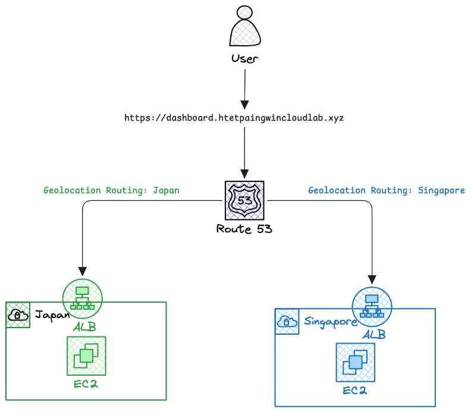

### DNS Resolution

The client resolves `dashboard.htetpaingwincloudlab.xyz` through Route 53 Geolocation Routing, which selects the Tokyo or Singapore Dashboard ALB.

### Application Traffic

| Layer | Tokyo | Singapore |
|---|---|---|
| Public entry point | Dashboard ALB: HTTPS `443` | Dashboard ALB: HTTPS `443` |
| Dashboard application | Private EC2: HTTP `8888` | Private EC2: HTTP `8888` |
| Internal entry point | Counting ALB: HTTP `80` | Counting ALB: HTTP `80` |
| Counting application | Private EC2: HTTP `9902` | Private EC2: HTTP `9902` |

Each regional Dashboard application sends requests to its regional internal Counting ALB. HTTP requests to the public Dashboard ALB on port `80` redirect to HTTPS on port `443`.

## 🌐 Regional Configuration

| Setting | Tokyo | Singapore |
|---|---|---|
| Region | `ap-northeast-1` | `ap-southeast-1` |
| Availability Zones | `ap-northeast-1a`, `ap-northeast-1c` | `ap-southeast-1a`, `ap-southeast-1c` |
| Dashboard ALB | Internet-facing | Internet-facing |
| Counting ALB | Internal | Internal |
| Dashboard port | `8888` | `8888` |
| Counting port | `9902` | `9902` |

---

## 🇯🇵 Tokyo Region Setup

### 1. Network Resources

| Resource | Name |
|---|---|
| VPC | `JP-VPC` |
| Public Subnet 1 | `JP-Public-1a` |
| Public Subnet 2 | `JP-Public-1c` |
| Private Subnet 1 | `JP-Private-1a` |
| Private Subnet 2 | `JP-Private-1c` |
| Internet Gateway | `JP-IGW` |
| Public Route Table | `JP-Public-RT` |
| Bastion Instance | `JP-Bastion` |
| Dashboard Instances | `JP-Dashboard-Instance-1a`, `JP-Dashboard-Instance-1c` |
| Counting Instances | `JP-Counting-Instance-1a`, `JP-Counting-Instance-1c` |
| Dashboard ALB | `JP-Dashboard-ALB` |
| Counting ALB | `JP-Counting-ALB` |
| Dashboard Target Group | `JP-Dashboard-Target-Group` |
| Counting Target Group | `JP-Counting-Target-Group` |

#### Network Configuration

| Network | CIDR | Availability Zone |
|---|---|---|
| VPC | `10.10.0.0/16` | — |
| `JP-Public-1a` | `10.10.1.0/24` | `ap-northeast-1a` |
| `JP-Public-1c` | `10.10.2.0/24` | `ap-northeast-1c` |
| `JP-Private-1a` | `10.10.11.0/24` | `ap-northeast-1a` |
| `JP-Private-1c` | `10.10.12.0/24` | `ap-northeast-1c` |

Attach `JP-IGW` to `JP-VPC`. Associate both public subnets with `JP-Public-RT` and configure:

```text
Destination: 0.0.0.0/0
Target:      JP-IGW
```

Enable VPC DNS resolution. Private subnet route tables retain the VPC local route for communication between the Dashboard and Counting components.

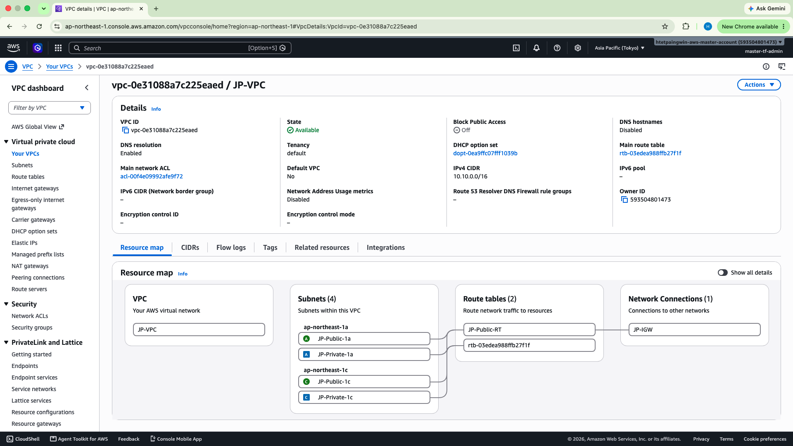

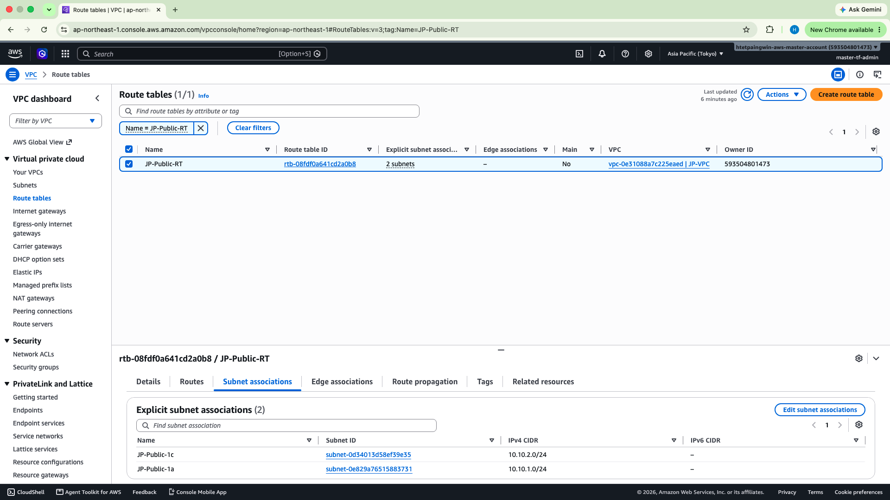
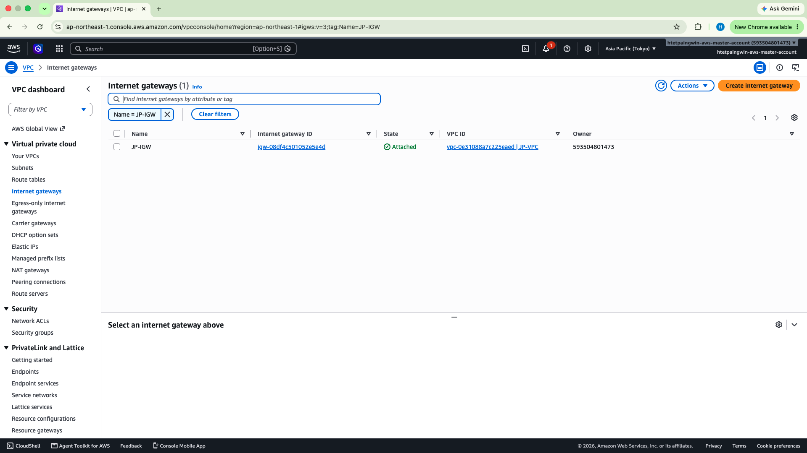

### 2. Bastion Security Group

```text
Security Group: JP-Bastion-SG

Inbound:
SSH 22 <- My IP /32

Outbound:
SSH 22 -> JP-Dashboard-Instance-SG
SSH 22 -> JP-Counting-Instance-SG
```

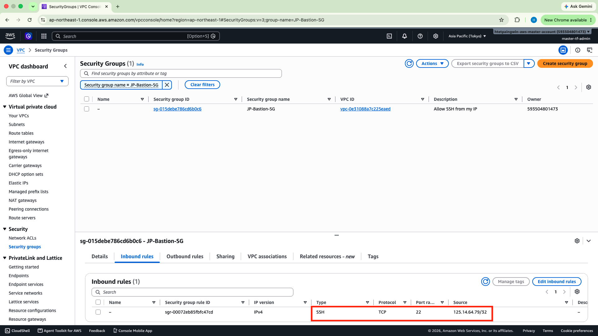
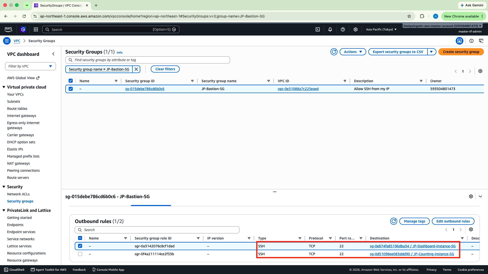

### 3. Dashboard ALB Security Group

```text
Security Group: JP-Dashboard-ALB-SG

Inbound:
HTTP 80   <- 0.0.0.0/0
HTTPS 443 <- 0.0.0.0/0

Outbound:
TCP 8888 -> JP-Dashboard-Instance-SG
```

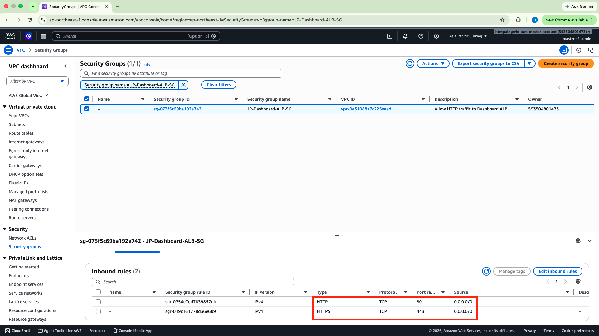
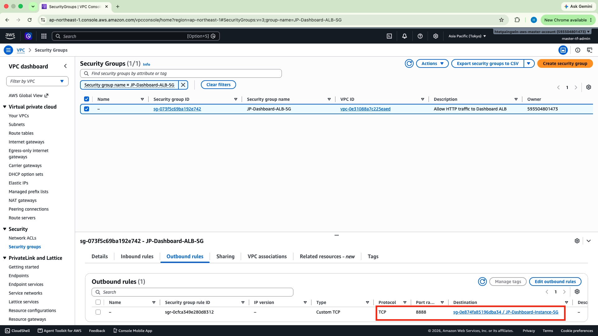

### 4. Dashboard Instance Security Group

```text
Security Group: JP-Dashboard-Instance-SG

Inbound:
TCP 8888 <- JP-Dashboard-ALB-SG
SSH 22   <- JP-Bastion-SG

Outbound:
HTTP 80 -> JP-Counting-ALB-SG
```


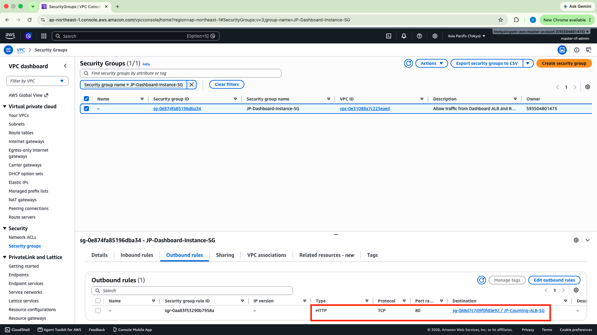

### 5. Counting ALB Security Group

```text
Security Group: JP-Counting-ALB-SG

Inbound:
HTTP 80 <- JP-Dashboard-Instance-SG

Outbound:
TCP 9902 -> JP-Counting-Instance-SG
```

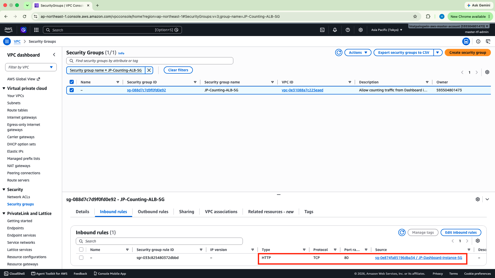
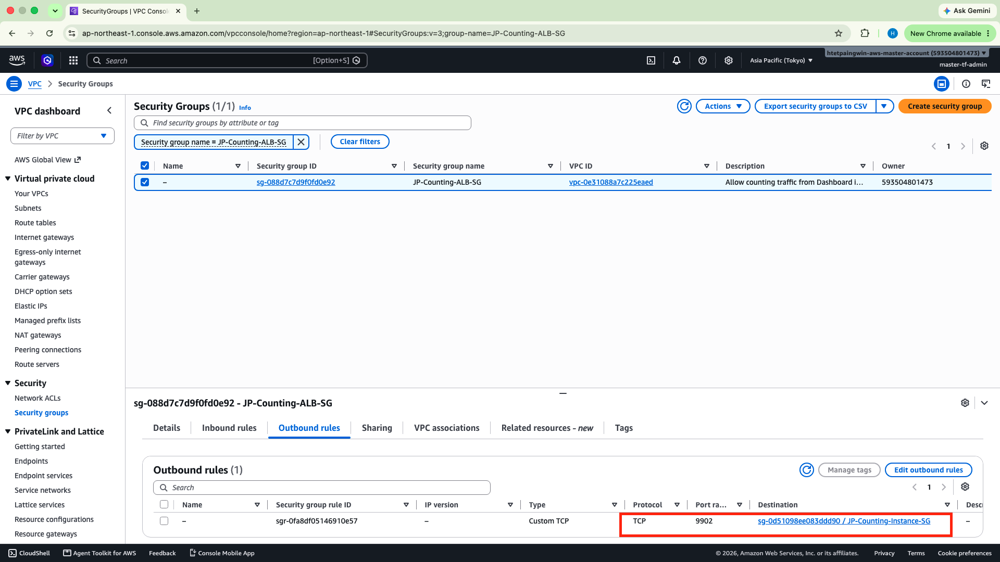

### 6. Counting Instance Security Group

```text
Security Group: JP-Counting-Instance-SG

Inbound:
TCP 9902 <- JP-Counting-ALB-SG
SSH 22   <- JP-Bastion-SG

Outbound:
All Traffic -> 0.0.0.0/0
```

An outbound security group rule does not itself provide internet connectivity to a private subnet.

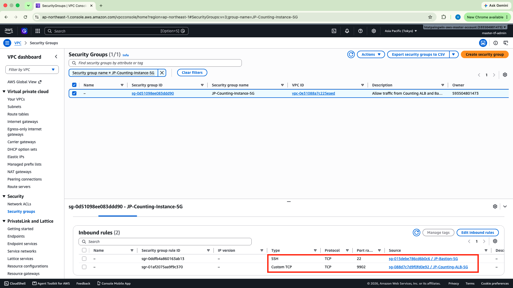
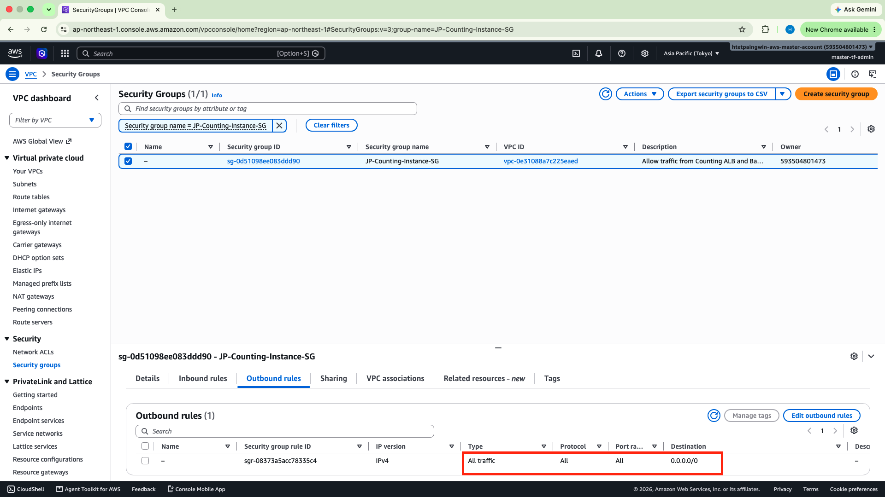

### 7. Counting Instance Setup

Create two Counting EC2 instances with no public IP address:

| Instance | Subnet | Security Group | Application Port |
|---|---|---|---|
| `JP-Counting-Instance-1a` | `JP-Private-1a` | `JP-Counting-Instance-SG` | `9902` |
| `JP-Counting-Instance-1c` | `JP-Private-1c` | `JP-Counting-Instance-SG` | `9902` |

The deployment commands below assume Ubuntu and x86_64 instances.


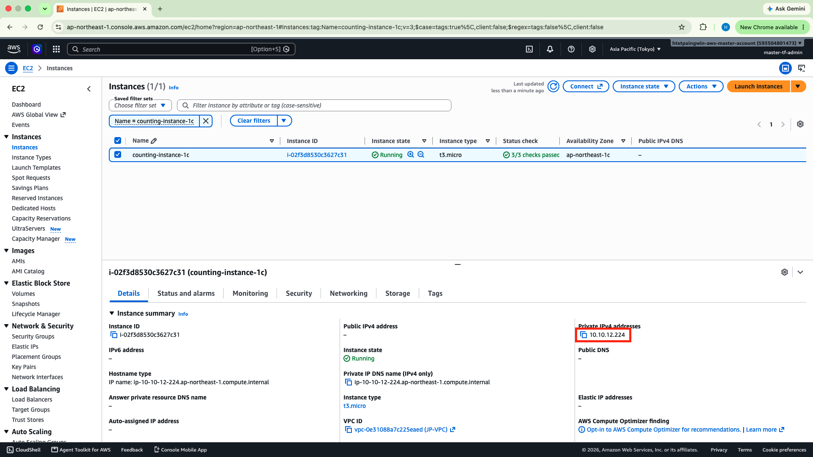

### 8. Counting Service Deployment

Run the build command from the Counting service source directory on your local machine:

```bash
CGO_ENABLED=0 GOOS=linux GOARCH=amd64 go build -o counting-service-linux-amd64 .
```

#### Local → Bastion → Counting Instance

Copy the binary directly through the bastion using SSH ProxyCommand. Replace all placeholders with your actual values. Keep the private key on your local machine.

```bash
scp -i <key.pem> \
  -o 'ProxyCommand=ssh -i <key.pem> -W %h:%p ubuntu@<JP_BASTION_PUBLIC_IP>' \
  counting-service-linux-amd64 \
  ubuntu@<JP_COUNTING_PRIVATE_IP>:/home/ubuntu/
```

Connect to the Counting instance through the bastion:

```bash
ssh -i <key.pem> \
  -o 'ProxyCommand=ssh -i <key.pem> -W %h:%p ubuntu@<JP_BASTION_PUBLIC_IP>' \
  ubuntu@<JP_COUNTING_PRIVATE_IP>
```

#### Prepare the Application Directory

Run on each Counting instance:

```bash
sudo mkdir -p /opt/counting-service
sudo mv /home/ubuntu/counting-service-linux-amd64 /opt/counting-service/counting-service
sudo chmod +x /opt/counting-service/counting-service
```

#### Create the systemd Service

```bash
sudo nano /etc/systemd/system/counting-service.service
```

```ini
[Unit]
Description=Counting Service
After=network.target

[Service]
Type=simple
User=ubuntu
Group=ubuntu
WorkingDirectory=/opt/counting-service
Environment=PORT=9902
ExecStart=/opt/counting-service/counting-service
Restart=always
RestartSec=5

[Install]
WantedBy=multi-user.target
```

The application must read `PORT` and listen on the instance's network interface, such as `0.0.0.0:9902`.

#### Start the Service

```bash
sudo systemctl daemon-reload
sudo systemctl enable --now counting-service
sudo systemctl status counting-service
```

Repeat deployment for both Counting instances.

### 9. Counting Target Group

```text
Name:                  JP-Counting-Target-Group
Target Type:           Instances
Protocol:              HTTP
Port:                  9902
VPC:                   JP-VPC
Health Check Protocol: HTTP
Health Check Path:     /
```

Register `JP-Counting-Instance-1a` and `JP-Counting-Instance-1c` on port `9902`. The health check path must return a successful response from the application.

After the target group is attached to the ALB in the next step, verify both targets become `Healthy`.

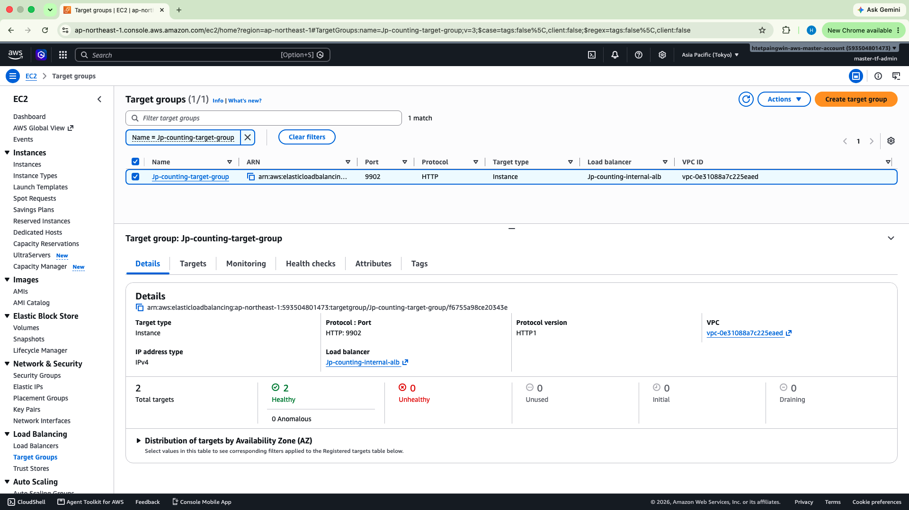

### 10. Counting Internal Application Load Balancer

```text
Name:            JP-Counting-ALB
Scheme:          Internal
IP Address Type: IPv4
VPC:             JP-VPC
Subnets:         JP-Private-1a, JP-Private-1c
Security Group:  JP-Counting-ALB-SG

Listener:
HTTP :80 -> JP-Counting-Target-Group :9902
```

Save the internal ALB DNS name for the Dashboard service configuration.

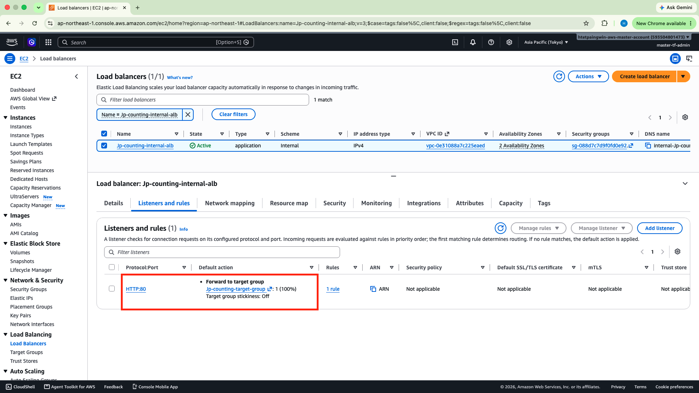
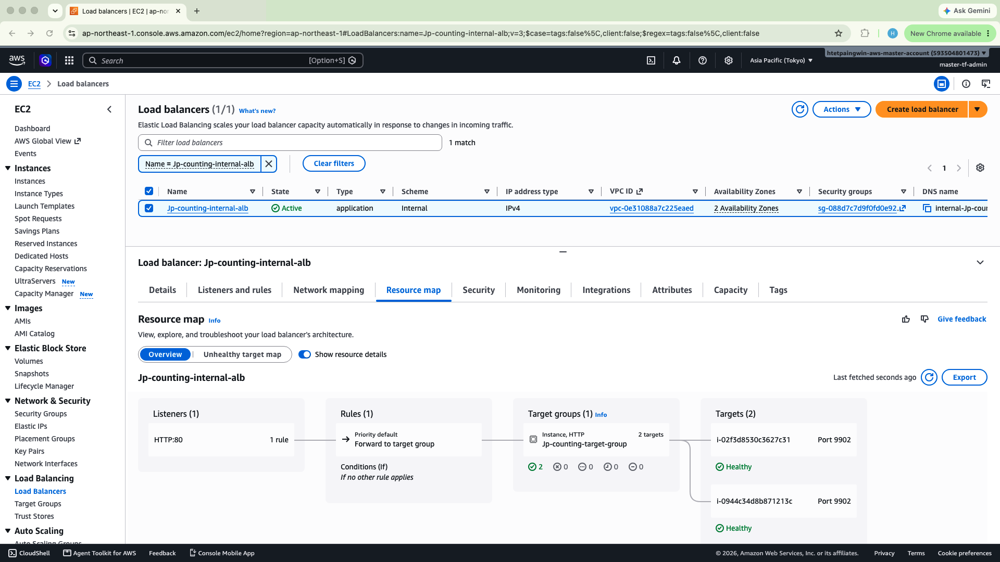

### 11. Dashboard Instance Setup

Create two Dashboard EC2 instances with no public IP address:

| Instance | Subnet | Security Group | Application Port |
|---|---|---|---|
| `JP-Dashboard-Instance-1a` | `JP-Private-1a` | `JP-Dashboard-Instance-SG` | `8888` |
| `JP-Dashboard-Instance-1c` | `JP-Private-1c` | `JP-Dashboard-Instance-SG` | `8888` |

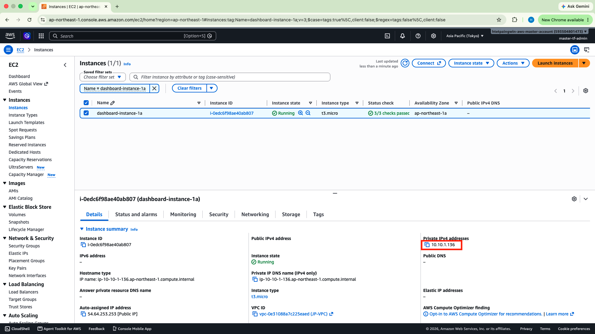
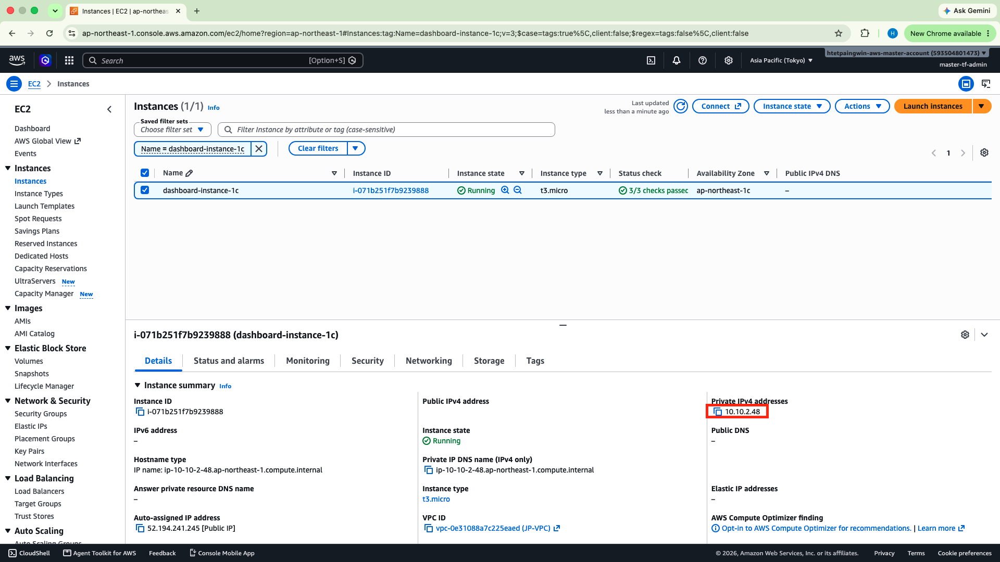

### 12. Dashboard Service Deployment

Run from the Dashboard service source directory on your local machine:

```bash
CGO_ENABLED=0 GOOS=linux GOARCH=amd64 go build -o dashboard-service-linux-amd64 .
```

#### Local → Bastion → Dashboard Instance

```bash
scp -i <key.pem> \
  -o 'ProxyCommand=ssh -i <key.pem> -W %h:%p ubuntu@<JP_BASTION_PUBLIC_IP>' \
  dashboard-service-linux-amd64 \
  ubuntu@<JP_DASHBOARD_PRIVATE_IP>:/home/ubuntu/
```

```bash
ssh -i <key.pem> \
  -o 'ProxyCommand=ssh -i <key.pem> -W %h:%p ubuntu@<JP_BASTION_PUBLIC_IP>' \
  ubuntu@<JP_DASHBOARD_PRIVATE_IP>
```

#### Prepare the Application Directory

Run on each Dashboard instance:

```bash
sudo mkdir -p /opt/dashboard-service
sudo mv /home/ubuntu/dashboard-service-linux-amd64 /opt/dashboard-service/dashboard-service
sudo chmod +x /opt/dashboard-service/dashboard-service
```

#### Create the systemd Service

```bash
sudo nano /etc/systemd/system/dashboard-service.service
```

```ini
[Unit]
Description=Dashboard Service
After=network.target

[Service]
Type=simple
User=ubuntu
Group=ubuntu
WorkingDirectory=/opt/dashboard-service
Environment=PORT=8888
Environment=COUNTING_SERVICE_URL=http://<JP_COUNTING_INTERNAL_ALB_DNS>/
ExecStart=/opt/dashboard-service/dashboard-service
Restart=always
RestartSec=5

[Install]
WantedBy=multi-user.target
```

Replace `<JP_COUNTING_INTERNAL_ALB_DNS>` with the DNS name of `JP-Counting-ALB`.

Example:

```ini
Environment=COUNTING_SERVICE_URL=http://internal-jp-counting-alb-xxxxxxxx.ap-northeast-1.elb.amazonaws.com/
```

The application must read these environment variables and listen on the instance's network interface, such as `0.0.0.0:8888`. Configure the regional page label as `Dashboard From Tokyo` using the application's supported configuration or source code.

#### Start the Service

```bash
sudo systemctl daemon-reload
sudo systemctl enable --now dashboard-service
sudo systemctl status dashboard-service
```

Repeat deployment for both Dashboard instances.

### 13. Dashboard Target Group

```text
Name:                  JP-Dashboard-Target-Group
Target Type:           Instances
Protocol:              HTTP
Port:                  8888
VPC:                   JP-VPC
Health Check Protocol: HTTP
Health Check Path:     /
```

Register `JP-Dashboard-Instance-1a` and `JP-Dashboard-Instance-1c` on port `8888`.

After attaching the target group to the ALB, verify both targets become `Healthy`.

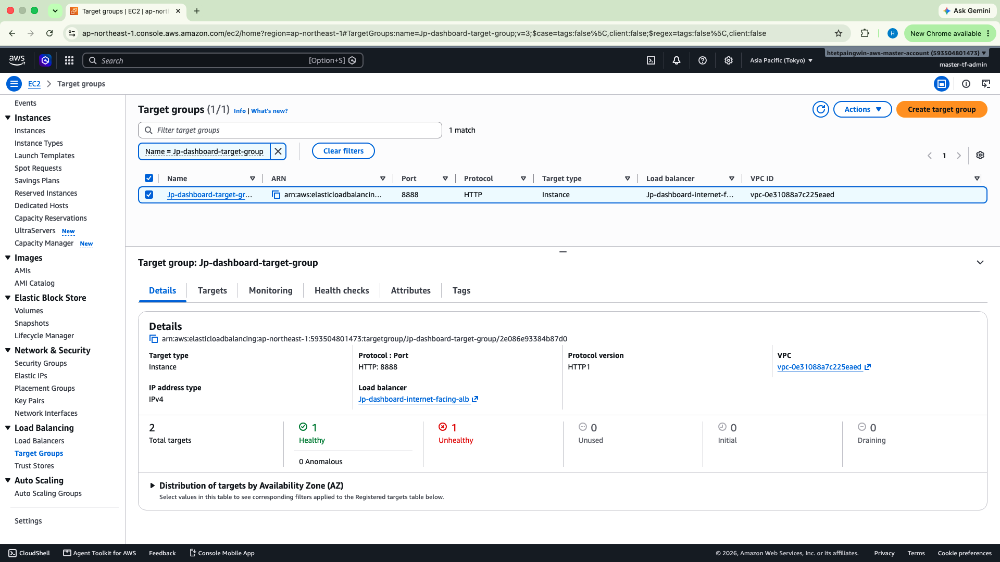

### 14. Dashboard Internet-Facing Application Load Balancer

```text
Name:            JP-Dashboard-ALB
Scheme:          Internet-facing
IP Address Type: IPv4
VPC:             JP-VPC
Subnets:         JP-Public-1a, JP-Public-1c
Security Group:  JP-Dashboard-ALB-SG
```

Final listener configuration:

| Listener | Action |
|---|---|
| HTTP `80` | Redirect to HTTPS `443` using HTTP `301` |
| HTTPS `443` | Forward to `JP-Dashboard-Target-Group` on HTTP `8888` |

Attach the Tokyo ACM certificate described in step 16 to the HTTPS listener. HTTPS setup is completed after certificate validation.

```text
Redirect protocol: HTTPS
Redirect host:     #{host}
Redirect port:     443
Redirect path:     /#{path}
Redirect query:    #{query}
Status code:       HTTP_301
```

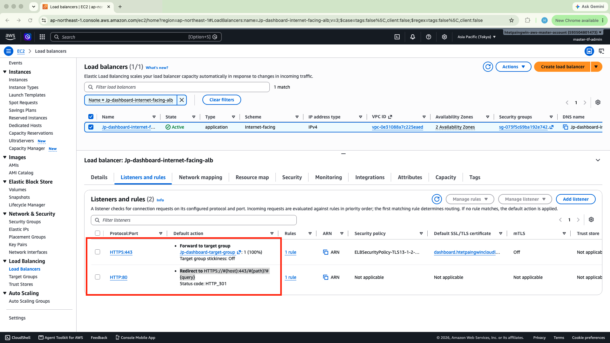
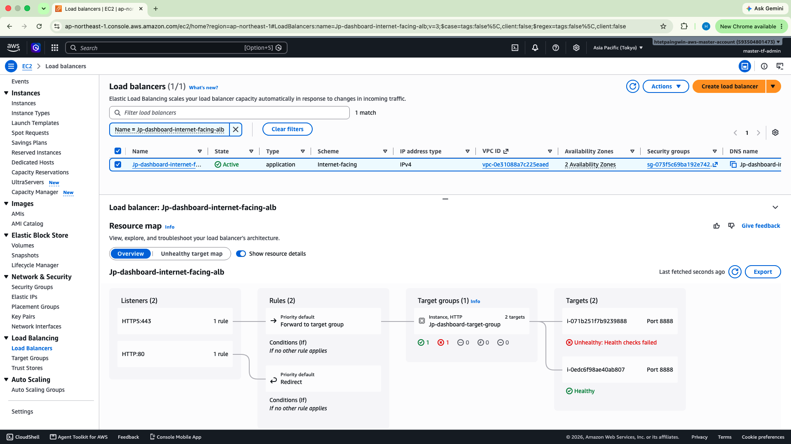

### 15. Verify Service Status

Verify both systemd services are active, both target groups have healthy targets, and the Dashboard can reach the internal Counting ALB. After ACM and Route 53 configuration, verify the Dashboard through the project domain.

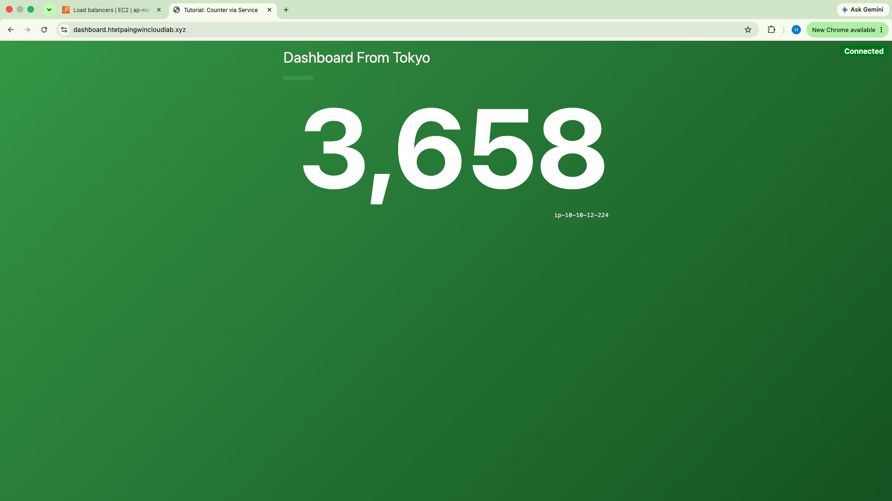

---

## 🇸🇬 Singapore Region Setup

Create the same VPC, EC2, security group, target group, ALB, and systemd service configuration in Singapore (`ap-southeast-1`), using `SG-` resource names, Singapore Availability Zones, the Singapore Counting ALB DNS name, and the page label `Dashboard From Singapore`.

---

## 🔒 SSL/TLS Certificates

AWS Certificate Manager (ACM) certificates are created separately in Tokyo and Singapore for:

```text
dashboard.htetpaingwincloudlab.xyz
```

### 16. Tokyo ACM Certificate

```text
Region:           ap-northeast-1
Domain:           dashboard.htetpaingwincloudlab.xyz
Certificate Type: Public Certificate
Validation:       DNS Validation
```

Create the ACM-provided DNS validation CNAME in the authoritative hosted zone. Once the certificate status is `Issued`, attach it to the Tokyo Dashboard ALB HTTPS listener.


### 17. Singapore ACM Certificate

```text
Region:           ap-southeast-1
Domain:           dashboard.htetpaingwincloudlab.xyz
Certificate Type: Public Certificate
Validation:       DNS Validation
```

Validate the certificate using the ACM-provided DNS record. Once its status is `Issued`, attach it to the Singapore Dashboard ALB HTTPS listener.


### HTTP to HTTPS Redirect

Apply the same listener configuration to both Dashboard ALBs:

| Listener | Action | Destination |
|---|---|---|
| HTTP `80` | HTTP `301` redirect | HTTPS `443`, preserving host, path, and query |
| HTTPS `443` | Forward | Regional Dashboard target group: HTTP `8888` |

TLS terminates at the Dashboard ALB. Traffic from the ALB to Dashboard instances uses HTTP.


---

## 🌍 Route 53 Configuration

### 18. Public Hosted Zone and DNS Delegation

```text
Hosted Zone: htetpaingwincloudlab.xyz
Type:        Public Hosted Zone
```

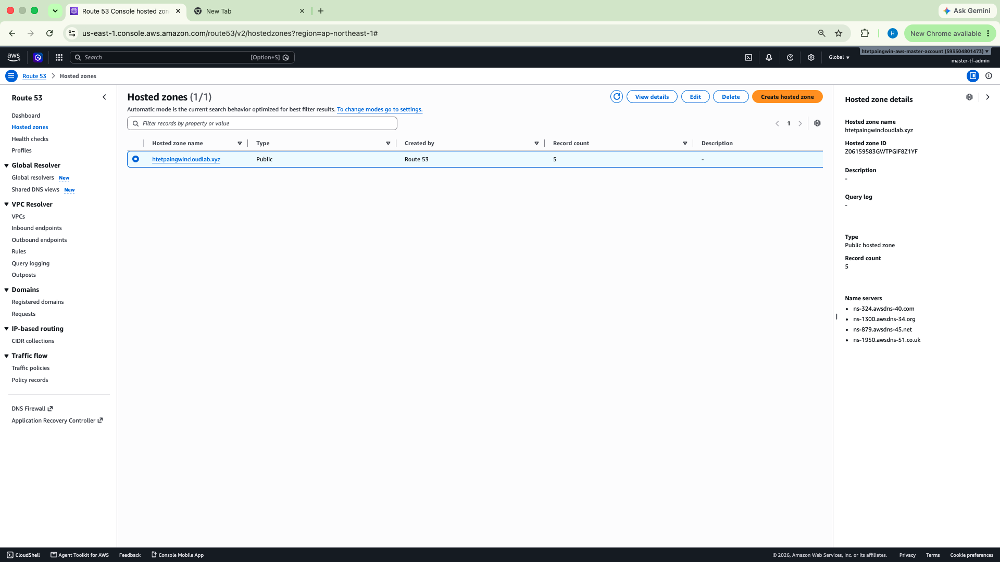

The domain was registered with Namecheap. Change the domain's nameservers from Namecheap BasicDNS to the four authoritative nameservers assigned to this Route 53 hosted zone.

Example only — use the actual values from your hosted zone:

```text
ns-324.awsdns-40.com
ns-1300.awsdns-34.org
ns-879.awsdns-45.net
ns-1950.awsdns-51.co.uk
```

Verify delegation:

```bash
dig NS htetpaingwincloudlab.xyz
```

Confirm the returned nameservers match the four nameservers assigned by Route 53. A `NOERROR` response alone does not confirm that delegation points to the correct hosted zone.

### 19. Japan Geolocation Record

Replace the original Simple Routing record for the Dashboard hostname with Geolocation Routing records.

```text
Record Name:    dashboard.htetpaingwincloudlab.xyz
Record Type:    A
Alias:          Yes
Routing Policy: Geolocation
Location:       Japan
Target:         Tokyo Dashboard ALB
Record ID:      JP
```

### 20. Singapore Geolocation Record

```text
Record Name:    dashboard.htetpaingwincloudlab.xyz
Record Type:    A
Alias:          Yes
Routing Policy: Geolocation
Location:       Singapore
Target:         Singapore Dashboard ALB
Record ID:      SG
```

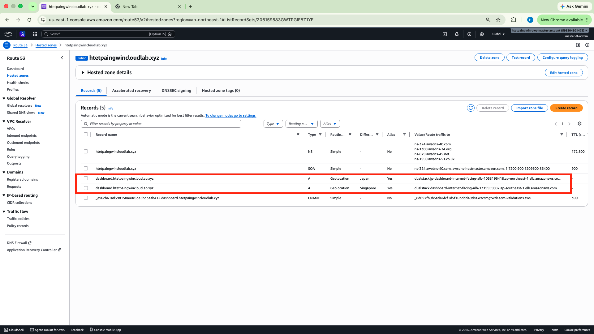

> This lab documents Japan and Singapore records. A Default geolocation record is recommended for other or unmapped locations. Without a matching location record or a Default record, Route 53 returns no answer. A Default record is not claimed as part of the completed lab.

---

## 🧪 Geolocation Testing

After changing VPN location, allow cached DNS answers to expire or clear the relevant DNS cache. Browser Secure DNS and resolver selection can affect the routing result.

### 🇯🇵 Japan Test

```text
VPN Location:    Japan
URL:             https://dashboard.htetpaingwincloudlab.xyz
Expected Result: Dashboard From Tokyo
```

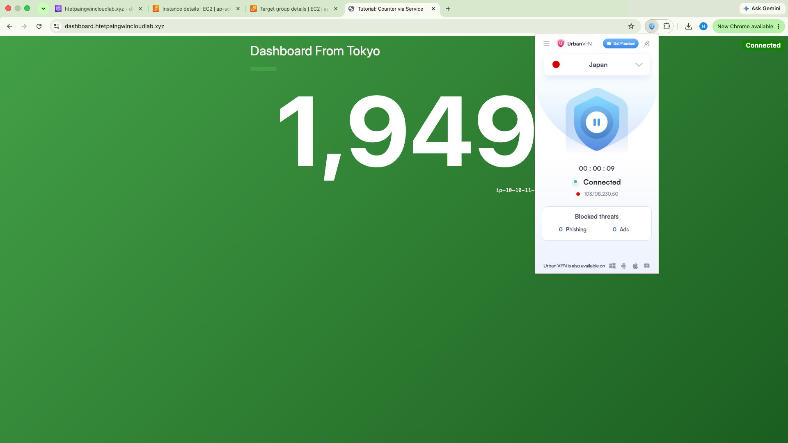
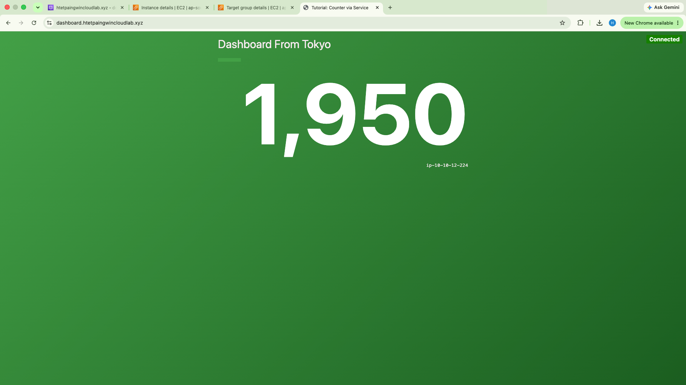

### 🇸🇬 Singapore Test

```text
VPN Location:    Singapore
URL:             https://dashboard.htetpaingwincloudlab.xyz
Expected Result: Dashboard From Singapore
```

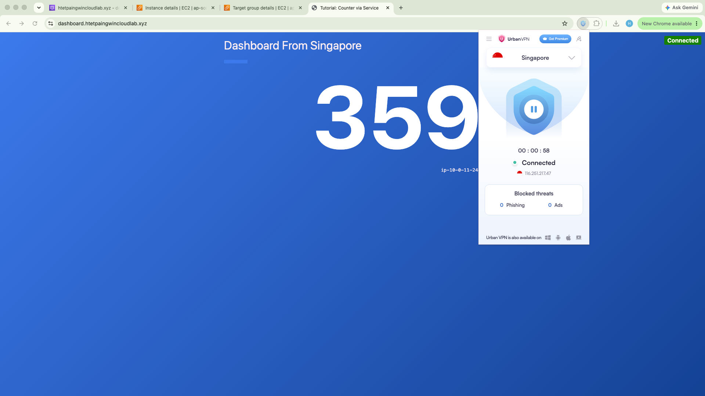
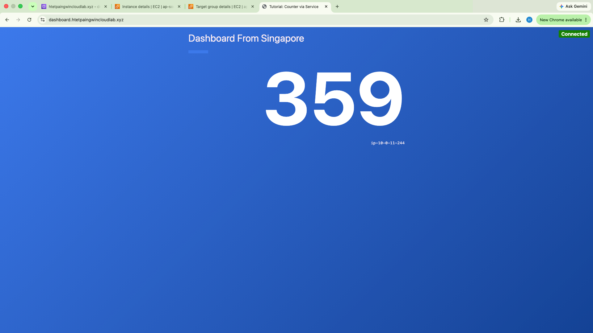

## ✅ Final Result

The lab demonstrated access to two regional Dashboard environments through the same domain:

| Test Location | DNS Destination | Application Request Path |
|---|---|---|
| Japan | Tokyo Dashboard ALB | Tokyo Dashboard ALB → Dashboard EC2 → Counting ALB → Counting EC2 |
| Singapore | Singapore Dashboard ALB | Singapore Dashboard ALB → Dashboard EC2 → Counting ALB → Counting EC2 |

## 🏁 Project Outcome

- ✅ Multi-region deployment in Tokyo and Singapore
- ✅ Separate regional VPC infrastructure
- ✅ Public Dashboard ALBs and internal Counting ALBs
- ✅ Bastion access to private EC2 instances
- ✅ Dashboard service on port `8888`
- ✅ Counting service on port `9902`
- ✅ systemd service management
- ✅ Regional ACM certificates and HTTPS on port `443`
- ✅ HTTP to HTTPS redirection
- ✅ Route 53 public hosted zone and Namecheap DNS delegation
- ✅ Geolocation Routing: Japan → Tokyo, Singapore → Singapore
- ✅ VPN-based routing tests

---

## 📁 Repository Structure

The paths below match the image references in this README. Add the corresponding screenshot files using these exact names.

```text
README.md
screenshots/geolocation-routing-architecture.png
screenshots/tokyo/jp-vpc.png
screenshots/tokyo/jp-subnets.png
screenshots/tokyo/jp-route-table.png
screenshots/tokyo/jp-igw.png
screenshots/tokyo/jp-bastion-sg-inbound.png
screenshots/tokyo/jp-bastion-sg-outbound.png
screenshots/tokyo/jp-dashboard-alb-sg-inbound.png
screenshots/tokyo/jp-dashboard-alb-sg-outbound.png
screenshots/tokyo/jp-dashboard-instance-sg-inbound.png
screenshots/tokyo/jp-dashboard-instance-sg-outbound.png
screenshots/tokyo/jp-counting-alb-sg-inbound.png
screenshots/tokyo/jp-counting-alb-sg-outbound.png
screenshots/tokyo/jp-counting-instance-sg-inbound.png
screenshots/tokyo/jp-counting-instance-sg-outbound.png
screenshots/tokyo/jp-counting-instance-1a.png
screenshots/tokyo/jp-counting-instance-1c.png
screenshots/tokyo/jp-counting-target-group.png
screenshots/tokyo/jp-counting-alb.png
screenshots/tokyo/jp-counting-alb-resource-map.png
screenshots/tokyo/jp-dashboard-instance-1a.png
screenshots/tokyo/jp-dashboard-instance-1c.png
screenshots/tokyo/jp-dashboard-target-group.png
screenshots/tokyo/jp-dashboard-alb.png
screenshots/tokyo/jp-dashboard-alb-resource-map.png
screenshots/tokyo/jp-dashboard-test.png
screenshots/tokyo-certificate.png
screenshots/singapore--certificate.png
screenshots/certificate/https-listener.png
screenshots/route53/route53-hosted-zone.png
screenshots/route53/geolocation-record.png
screenshots/testing/japan-vpn.png
screenshots/testing/dashboard-from-tokyo.png
screenshots/testing/singapore-vpn.png
screenshots/testing/dashboard-from-singapore.png
```

## 📚 References

- [AWS: Geolocation Routing](https://docs.aws.amazon.com/Route53/latest/DeveloperGuide/routing-policy-geo.html)
- [AWS: How Route 53 uses EDNS0 to estimate user location](https://docs.aws.amazon.com/Route53/latest/DeveloperGuide/routing-policy-edns0.html)

